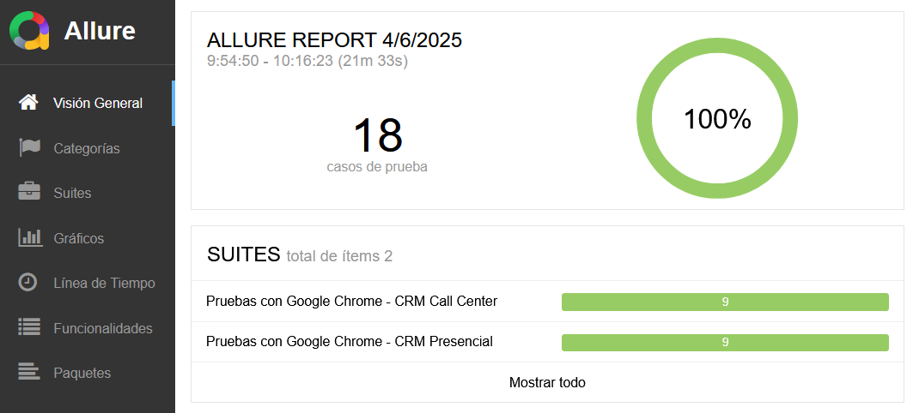

# Automatización Base

Proyecto de pruebas automatizadas con Selenium Web driver utilizando el marco de trabajo de pruebas de TestNG con lenguaje Java, gestionando módulos, paquetes, dependencias y compilación de código con herramienta Maven. Además, de generar reportes con herramienta Allure reports.

## Herramientas necesarias

Es necesario la instalación de tres herramientas para la ejecución del proyecto, las cuales son:

* JDK 23 
* Apache Maven 
* Allure Reports

Las herramientas se pueden encontrar en el siguiente enlace: [Herramientas](https://chileatiendet.sharepoint.com/sites/AnalistasdeCalidad/Documentos%20compartidos/Forms/AllItems.aspx?id=%2Fsites%2FAnalistasdeCalidad%2FDocumentos%20compartidos%2FRepositorio%20Publico%2FRequerimientos%20QA%2FAutomatizaci%C3%B3n%2FPruebas%20funcionales%2FHerramientas&viewid=a2b7ec2d%2D0e53%2D4d01%2D9b1e%2Dec8570da01ad&ga=1)

## Instalación de Herramientas

1. Extraer las herramientas descargadas en cualquier directorio del computador.
2. Agregar la ruta de cada una de las herramientas descargadas hasta "bin" en el path de las variables de entorno.
   * Ejemplo: D:\Herramientas\allure-2.33.0\bin
3. Agregar la variable de sistema "JAVA_HOME" y que esta apunte al directorio del jdk.
   * Ejemplo: D:\Herramientas\jdk-23.0.2

## Archivo de configuración (config.json)
Este archivo contiene los parámetros de configuración utilizados por el proyecto de automatización. Permite modificar 
fácilmente valores clave sin necesidad de alterar el código fuente.

Ejemplo de contenido de config.json:
```
{
  "webDriverConfiguration": {
    "headless": true,
    "downloads": "./src/test/resources/downloads/",
    "uploads": "./src/test/resources/uploads/",
    "evidences": "./src/test/resources/",
    "parallel": "tests",
    "threadCount": 9,
    "urlTest" : "Url de pruebas"
  },
  "tests": {
    "suiteTest": {
      "active" : true,
      "suiteName": "Nombre de la suite de pruebas",
      "flow": {
        "active": true,
        "name": "Nombre del flujo de prueba"
      }
    }
  },
  "dataExample": {
    "userExample": "Data externa"
  },
}
```
Descripción de los campos:

* webdriverConfiguration: objeto que contiene la configuración del web driver.
* headless: ejecuta el navegador en modo sin interfaz gráfica (true o false).
* downloads: ruta de la carpeta de descargas.
* uploads: ruta de la carpeta de los archivos para cargar en una web.
* evidences: ruta de la carpeta de evidencias.
* parallel: indica el método de pruebas (suites, tests o methods).
* threadCount: indica la cantidad de hilos que se ejecutaran por suite.

* tests: objeto que incluye todas las suite de pruebas.

* suiteTest: objeto que representa la suite de pruebas la cual contiene los flujos de pruebas.
* active: indica si la suite de pruebas se encuentra activa para su ejecución.
* suitename: nombre de la suite de pruebas.

* flow: objeto que representa a uno de los flujos de pruebas de la suite.
* active: indica si el flujo de pruebas se encuentra activo para su ejecución.
* name: nombre del flujo de pruebas.

* dataExample: objeto que contiene data externa que puede ser utilizada en la automatización.
* userExample: ejemplo de data externa.
```
 Nota: para los campos "suiteTest", "flow", "dataExample" y "userExample", sus nombres en esta 
       descripción son solo de ejemplo.
```
Uso del archivo:

El archivo es leído por la clase de configuración, TestNGXmlGenerator, al inicio de la ejecución de las pruebas. Para 
esto luego de haber modificado el archivo con los datos deseados se debe ejecutar el siguiente comando:
```
mvn exec:java "-Dexec.mainClass=utils.TestNGXmlGenerator"
```
Tras ejecutar este comando, se genera un directorio llamado "suites" ubicado en la ruta src/test/resources el cual 
contiene los archivos .xml que corresponden a las suites de pruebas.

## Ejecución a tráves de línea de comandos

Una vez generados los archivos de suites de pruebas ya es posible ejecutar el proyecto de automatización, a 
continuación se detallan los pasos a seguir para una correcta ejecución:

1. Dirigirse al directorio del proyecto en donde se encuentra el archivo testng.xml
   ```
   cd C:\usuario\escritorio\Selenium-Java-TestNG-Allure-Maven
   ```
2. Ejecutar el proyecto realizando una limpieza antes. (Ideal para la primera ejecución)
   ```
   mvn clean test -DsuiteXmlFile=testng
   ```
   Ejecutar el proyecto sin realizar limpieza del target.
   ```
   mvn test -DsuiteXmlFile=testng
   ```
3. Finalizada la ejecución dirigirse al directorio target.
   ```
   cd target
   ```
4. En directorio "target" generar reporte de allure
   ```
   allure generate allure-results --clean -o allure-report
   ```
5. Una vez generado el reporte se puede agregar el historial de ejecuciones, para esto primero se debera 
   crear el directorio. Solo se hace una vez, luego se volveria a usar si se ejecuta con mvn clean o el 
   directorio "target" es eliminado.
   ```
   mkdir -p allure-results/history
   ```
6. Creado el directorio para el historial se debe copiar el historial de allure-report en allure-results.
   
   Comando con powershell: 
   ```
   cp -r allure-report/history/* allure-results/history/
   ```     
   Comando con CMD:
   ```
   xcopy "RUTA_PROYECTO\target\allure-report\history\" "RUTA_PROYECTO\target\allure-results\history" /h /i /c /k /e /r /y
   ```
7. Levantar allure
   ```
   allure open
   ```
8. Bajar allure
   ```  
   ctrl + c
   ```     
9. También es posible generar el reporte en un solo archivo. Para una correcta visualización hacer pasos 
   4 y 6, el archivo quedará disponible en la ruta "target/allure-report".
   ```
   allure generate --clean --single-file allure-results 
   ```
   
## Ejemplo de reportes de allure
