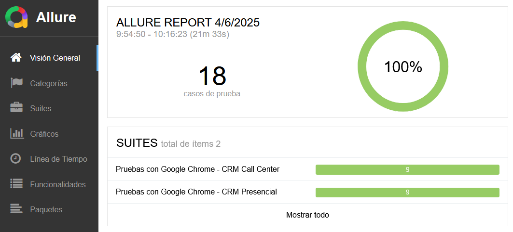

# Automatización MiCha

Este proyecto consiste en la automatización de pruebas funcionales utilizando Selenium WebDriver como herramienta principal para la interacción con aplicaciones web. Las pruebas están estructuradas con el framework de pruebas TestNG, lo que permite una gestión eficiente de casos de prueba, ejecución paralela y control personalizado de suites de prueba.

El desarrollo se realizó en Java, y se utilizó Apache Maven para la gestión de dependencias, construcción del proyecto y organización modular del código en paquetes reutilizables y mantenibles.

Además, se integró Allure Reports para la generación de reportes visuales y detallados sobre los resultados de las ejecuciones de prueba, facilitando el análisis de fallos, la trazabilidad y el seguimiento del estado de cada escenario probado.

## Herramientas necesarias

Para ejecutar este proyecto de automatización es necesario tener instaladas las siguientes herramientas en el entorno de desarrollo:

>* Java Development Kit (JDK) 23 – Requerido para compilar y ejecutar el código Java.
>* Apache Maven – Utilizado para la gestión de dependencias, compilación y ejecución del proyecto.
>* Allure Commandline – Necesario para generar y visualizar los reportes de ejecución de pruebas.

Las herramientas se pueden encontrar en el siguiente enlace: [Herramientas](https://chileatiendet.sharepoint.com/sites/AnalistasdeCalidad/Documentos%20compartidos/Forms/AllItems.aspx?id=%2Fsites%2FAnalistasdeCalidad%2FDocumentos%20compartidos%2FRepositorio%20Publico%2FRequerimientos%20QA%2FAutomatizaci%C3%B3n%2FPruebas%20funcionales%2FHerramientas&viewid=a2b7ec2d%2D0e53%2D4d01%2D9b1e%2Dec8570da01ad&ga=1)

## Instalación de Herramientas

1. **Extraer las herramientas**  
   Descarga y descomprime cada herramienta en el directorio que prefieras.
   > Ejemplo:  
   > `D:\Herramientas\jdk-23.0.2`  
   > `D:\Herramientas\apache-maven-3.9.6`  
   > `D:\Herramientas\allure-2.33.0`

2. **Agregar rutas al `PATH` del sistema**  
   Agrega las siguientes rutas (hasta la carpeta `bin`) en las variables de entorno del sistema (`PATH`):

   > `D:\Herramientas\jdk-23.0.2\bin`
   > `D:\Herramientas\apache-maven-3.9.6\bin`
   > `D:\Herramientas\allure-2.33.0\bin`

3. **Configurar la variable de sistema `JAVA_HOME`**  
   Crea una variable de entorno llamada `JAVA_HOME` y asigna como valor la ruta de instalación del JDK (sin incluir `\bin`):

   > `JAVA_HOME = D:\Herramientas\jdk-23.0.2`

4. **Verificar configuración**  
   Abre una terminal y ejecuta los siguientes comandos para verificar que todo está correctamente configurado:

   ```bash
   java -version
   mvn -version
   allure --version

## Archivo de configuración (config.json)
Este archivo contiene los parámetros clave de configuración utilizados por el proyecto de automatización. Su propósito es permitir la modificación dinámica de valores importantes sin necesidad de alterar el código fuente.

Ejemplo de contenido de config.json:
```
{
  "webDriverConfiguration": {
    "cleanProject": false,
    "cleanReport": true,
    "headless": true,
    "retry": false,
    "retryCount": 0,
    "downloads": "src/test/resources/downloads/",
    "uploads": "./src/test/resources/uploads/",
    "evidences": "./src/test/resources/evidencias/",
    "parallel": "tests",
    "threadCount": 25,
    "environment": "QA",
    "browserSize": "--window-size=1920,1080",
    "webdriverHidden": false
    "browser": "CHROME"
  },
  "tests": {
    "suiteTest": {
      "active" : true,
      "suiteName": "Nombre de la suite de pruebas",
      "flow": {
        "active": true,
        "name": "Nombre del flujo de prueba"
      }
    }
  },
  "dataExample": {
    "userExample": "Data externa"
  },
}
```
## Detalle de configuración – `config.json`

### `webDriverConfiguration`

Contiene la configuración relacionada con la ejecución del navegador:

- **`headless`**: Ejecuta el navegador en modo sin interfaz gráfica (true o false).
- **`cleanProject`**: realiza una limpieza completa del proyecto antes de ejecutar (true o false).
- **`cleanReport`**: realiza una limpieza de los reportes generados anteriormente (true o false).
- **`headless`**: ejecuta el navegador en modo sin interfaz gráfica (true o false).
- **`retry`**: habilita los reintentos de las pruebas (true o false).
- **`retryCount`**: cantidad de reintentos por prueba fallida.

- **`downloads`**: Ruta donde se guardarán los archivos descargados.
- **`uploads`**: Ruta de los archivos que se usarán para carga en formularios web.
- **`evidences`**: Ruta donde se almacenarán evidencias (screenshots, logs, etc.).
- **`parallel`**: Tipo de paralelismo para la ejecución de pruebas (suites, tests, methods).
- **`threadCount`**: Número de hilos utilizados para la ejecución paralela.
- **`environment`**: Ambiente de pruebas que se ejecutara (DEV, QA, PROD).
- **`browserSize`**: Para definir el tamaño de la ventana del navegador.
- **`webdriverHidden`**: Para ocultar el uso del webdriver al navegador (true o false).
- **`browser`**: Para indicar cual es navegador que se utilizara (CHROME, FIREFOX, EDGE).

---

### `tests`

Objeto que contiene la definición de las suites y flujos de pruebas a ejecutar:

- **`suiteTest`**: Objeto que representa una suite de pruebas.
   - **`active`**: Define si la suite está activa para su ejecución (`true` o `false`).
   - **`suiteName`**: Nombre identificador de la suite.
   - **`flow`**: Objeto que representa un flujo de prueba dentro de la suite.
      - **`active`**: Define si el flujo está activo para su ejecución.
      - **`name`**: Nombre del flujo de prueba.
---

### `dataExample`

Contiene datos externos que pueden ser utilizados durante la ejecución de pruebas:

- **`userExample`**: Ejemplo de valor externo que puede utilizarse en una prueba.

> **Nota:** Los nombres como `suiteTest`, `flow`, `dataExample` y `userExample` son solo ejemplos.  
> Se pueden renombrar según la lógica o estructura de pruebas del proyecto.

### Uso del archivo:

El archivo `config.json` es leído automáticamente al inicio de la ejecución por la clase `TestNGXmlGenerator`, la cual se encarga de generar dinámicamente los archivos `.xml` de TestNG que definen las suites de pruebas activas según la configuración establecida.

### Pasos para utilizarlo (Manual):

1. Modifica el archivo `config.json` con los valores deseados (activación de suites, flujos, datos, etc.).
2. Ejecuta el siguiente comando Maven en la raíz del proyecto:

   ```
   mvn exec:java "-Dexec.mainClass=utils.TestNGXmlGenerator"

## Ejecución a tráves de línea de comandos (Manual)

Una vez generados los archivos de suites de pruebas ya es posible ejecutar el proyecto de automatización, a
continuación se detallan los pasos a seguir para una correcta ejecución:

1. Dirigirse al directorio del proyecto en donde se encuentra el archivo testng.xml
   ```
   cd C:\usuario\escritorio\Selenium-Java-TestNG-Allure-Maven
   ```
2. Ejecutar el proyecto realizando una limpieza del proyecto antes. (Ideal para la primera ejecución)
   ```
   mvn clean test -DsuiteXmlFile=testng
   ```
   Ejecutar el proyecto sin realizar limpieza del target.
   ```
   mvn test -DsuiteXmlFile=testng
   ```
3. Finalizada la ejecución, accede al directorio donde se generan los resultados y reportes.
   ```
   cd target
   ```
4. En directorio "target" generar reporte de allure
   ```
   allure generate allure-results --clean -o allure-report
   ```
5. Para mantener el historial de ejecuciones en los reportes futuros, crea el directorio correspondiente.
   Si el directorio target es limpiado (mvn clean) o eliminado, deberás repetir este paso.
   ```
   mkdir -p allure-results/history
   ```
6. Creado el directorio para el historial se debe copiar el historial de allure-report en allure-results.

   Comando con powershell:
   ```
   cp -r allure-report/history/* allure-results/history/
   ```     
   Comando con CMD:
   ```
   xcopy "RUTA_PROYECTO\target\allure-report\history\" "RUTA_PROYECTO\target\allure-results\history" /h /i /c /k /e /r /y
   ```
7. Levantar allure
   ```
   allure open
   ```
8. Bajar allure
   ```  
   ctrl + c
   ```     
9. También es posible generar el reporte en un solo archivo. Para una correcta visualización hacer pasos
   4 y 6, el archivo quedará disponible en la ruta "target/allure-report".
   ```
   allure generate --clean --single-file allure-results 
   ```
## Ejecución a tráves de archivo ps1 (PowerShell)

Se puede ejecutar la automatización de forma sencilla utilizando el archivo ubicado en el directorio "scripts"
del proyecto llamado "run-test.ps1". Para esta ejecución es necesario habilitar la ejecución de script con powershell y
ya solo se deben indicar los valores deseados en el archivo "config.json".
   ```
   Set-ExecutionPolicy RemoteSigned 
   ```

## Ejecución a tráves de archivo bat (CMD)

Se puede ejecutar la automatización de forma sencilla utilizando el archivo ubicado en el directorio "scripts"
del proyecto llamado "test.bat". Para esta ejecución solo se deben indicar los valores deseados en el archivo
"config.json".

## Ejemplo de reportes de allure
